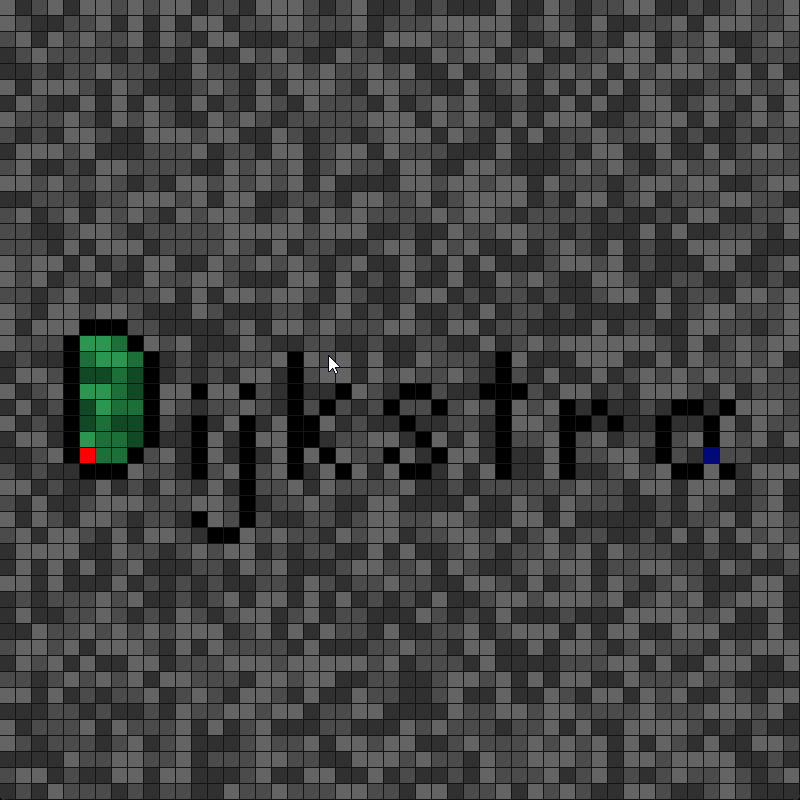
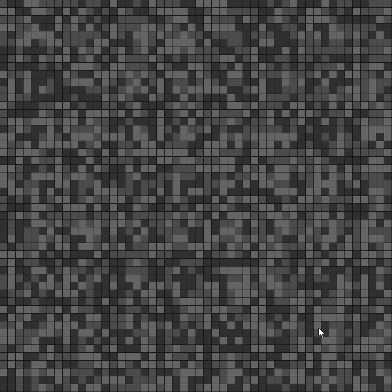

alternative dijkstra implementation using incoming weights

| Control     | Color     | Usage               |
| ----------- | --------- | ------------------- |
|Left Mouse   |Red        |Start                |
|Right Mouse  |Black      |Wall                 |
|Middle Mouse |Blue       |End                  |
|             |Dark Green |Reachable from Start |
|             |Light Green|Path to End          |
|Space        |           |Reset Path           |

Only requires installing [pygame-ce](https://pypi.org/project/pygame-ce/).

Images above show main.py script, which has more functionality and can be played around with more features.  

grid_dijkstra.py was a mvp demo, relatively quick performance with heapq even with larger grids.
